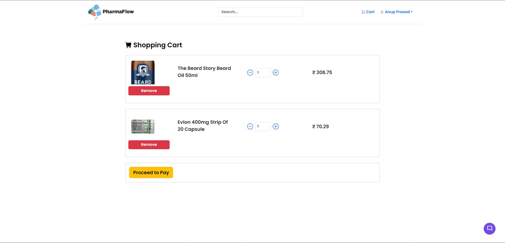
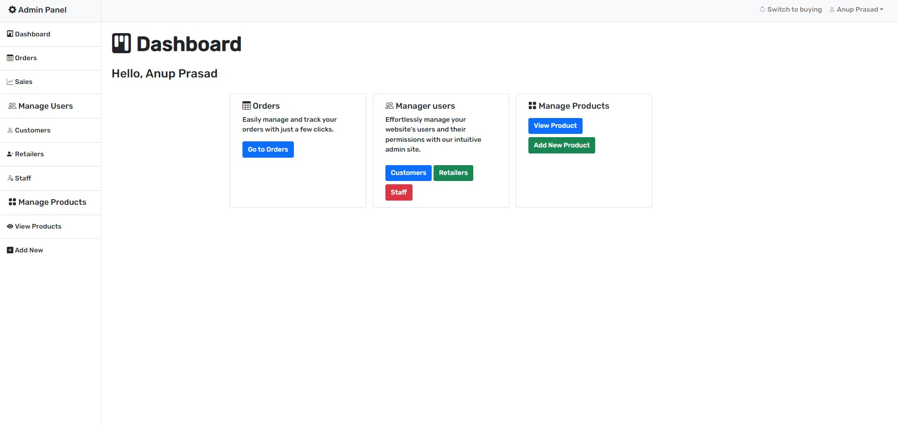

# PharmaFlow 🏥

PharmaFlow is a comprehensive pharmacy management and e-commerce platform built with Node.js and MongoDB. It provides a complete solution for managing pharmaceutical inventory, processing online orders, and handling secure payments through Razorpay integration.
## Installation 🚀

 Prerequisites

- Node.js (v14 or higher)
- MongoDB
- Razorpay account for payment processing
- npm or yarn package manager


1. Clone the repository:
```bash
git clone https://github.com/yourusername/pharmaflow.git
cd pharmaflow
```

2. Install dependencies:
```bash
npm install
```

3. Create a `.env` file in the root directory with the following variables:
```
MONGODB_URI=your_mongodb_connection_string
RAZORPAY_ID_KEY=your_razorpay_id
RAZORPAY_SECRET_KEY=your_razorpay_secret
```

4. Start the development server:
```bash
npm start
```

The application will start running on `http://localhost:3000`


## Development 💻

For development, the project uses nodemon to automatically restart the server when file changes are detected:

```bash
npm start
```
## Screenshots 📸







## Features ✨

- **Online Pharmacy Shopping**
  - Browse and purchase pharmaceutical products
  - User-friendly product catalog with search and filtering
  - Secure shopping cart functionality

- **Admin Dashboard**
  - Comprehensive inventory management
  - Order tracking and management
  - User management system
  - Sales analytics and reporting

- **Inventory Management**
  - Real-time stock tracking
  - Low stock alerts
  - Batch and expiry date management
  - Automated inventory reports

- **Secure Payments**
  - Integrated Razorpay payment gateway
  - Secure transaction processing


